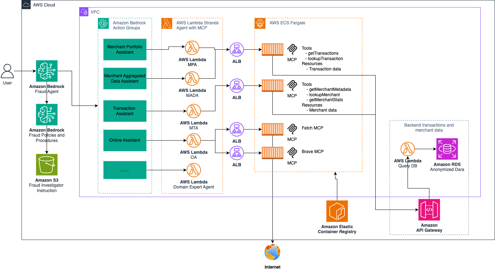
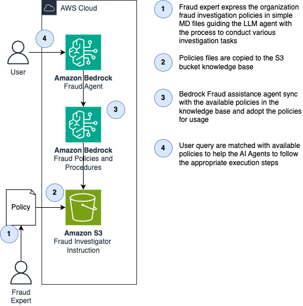
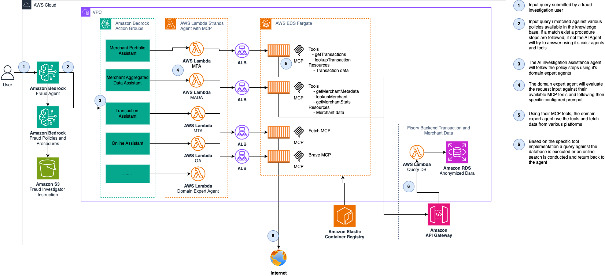

<!-- Copyright Amazon.com, Inc. or its affiliates. All Rights Reserved. -->
<!-- SPDX-License-Identifier: MIT-0 -->

# Fraud Investigator Assistant Agent 

## About the solution
The **Fraud Investigator Assistant** demonstrate how customers can revolutionized their fraud investigation process using AWS Bedrock, MCP (Model Context Protocol) servers, and Strands expert agents. Conducting investigation on fraud cases can take a lot of time. In addition, following various compliance and security policy checks requires specialty skill in each domain. Building an AI expert network can accelerate this work and allow customer to run investigations faster. This innovative approach combining custom MCP servers for private data with open-source MCPs for public information gathering, dramatically reducing investigation timelines.

Assistance capabilities:
- **Orchestrator Agent** - To decide which expert/s should be used when processing a request and which policy needs to be enforced.
- **Transactional Expert** - Analyzing merchant transactions & authorization data
- **Merchant Indicators Expert** - retrieve and analyze statistical aggregated data on merchants
- **Online Search Expert** - Perform merchant verification and online appearance
- **Policies Knowledge Base** - Allow scaling and executing of company policies for conducting investigation of a particular use case. 
- **Providing Intelligent Insights** - Through conversational AI
- **Integrating Tools** - For external data sources* via MCP protocol

## Table of Contents
1. [Architecture & Data Flow and ](#Architecture)
2. [Screen Shoots](#Screenshots)
3. [Tool Versions](#Versions)
4. [Prerequisites](#Prerequisites)
5. [Installation](#Deploy)
6. [User Interface](#UI)
7. [Database Schema](#Database)
8. [Testing](#Test)
9. [Destroy](#Destroy)
10. [Clean Up Cache](#CleanUpCache)
11. [License](#License)
12. [Package Dependencies](#Dependencies)

### Key Features
- **Amazon Bedrock Agent** with multiple action groups
- **Strands Agents** for domain expert agents: merchant portfolio agent, merchant aggregated data agent, merchant transaction agent, online assistant agent
- **MCP Servers Integration** for data access and web search(internal / external)
- **PostgreSQL Database** with merchant and transaction data
- **Streamlit UI** for interactive testing
- **Terraform Infrastructure** for AWS deployment
- **Comprehensive Testing** with functional unit tests

### Repository structure
```
app/                        # Application-level logic and data
build-script/               # Build scripts
data/                       # Mocked example data
environment/                # Environment variables generated by CPA Tool
iac/                        # All Terraform and application layer code
    bootstrap/              # Deploy bootstrapped infrastructure
    roots/                  # Main Terraform and application code
        app/
    templates/              # Terraform components and modules
images/                     # Architecture and other images for the 
tests/                      # Folder with different test scripts to check functionality
ui/                         # Interact with agent via Streamlit UI
Makefile                    # Scripts to deploy, destroy, and interact with IAC
README.md                   # This document which includes repository details and instructions
LICENSE                     # License file to use this project artifacts
```

## Architecture and Data Flow<a name="Architecture"></a>

### Architecture


### Data Flow
Fraud expert ingest policies to knowledge base



Fraud AI assistance process user query



### System Components

1. **Frontend Layer**
   - Streamlit UI for agent interaction
   - REST API endpoints for data access

2. **Agent Layer**
   - Amazon Bedrock Agent with multiple action groups:
     - Merchant Action Group
     - Transaction Action Group
     - Online/Internet Action Group

3. **MCP Server Layer**
   - **Merchant MCP**: Database queries for merchant data
   - **Transaction MCP**: Transaction analysis and filtering
   - **Fetch Search MCP**: Fetch the contents from URL and can be used for website verification
   - **Brave MCP**: Alternative search capabilities

4. **Data Layer**
   - **PostgreSQL (Aurora)**: Primary database with merchant/transaction data
   - **OpenSearch**: Knowledge base for policies and procedures
   - **S3**: Document storage

5. **Infrastructure**
   - **VPC**: Secure network isolation
   - **Lambda Functions**: Serverless compute
   - **API Gateway**: REST API management
   - **Secrets Manager**: Secure credential storage


## Screen shoots<a name="Screenshots>
Fetching merchant metadata information


Get last authorization transactions for a merchant


Get merchant stats data (default day, month/year also supported)


Fetch last year merchant total dispute volume


Fetch realtime online website content


Perform online search according to knowledegbase policy


## Tool Versions <a name="Versions"></a>

To build and deploy this system the following tools are required:

- **Python**: Version 3.12 or higher
- **AWS CLI**: Version 2.0 or higher, configured with appropriate credentials
- **Terraform**: Version >5.0
- **Make**: GNU Make 4.0 or higher
- **Bash**: Version 4.0 or higher
- **Streamlit**: For UI testing
- **Strands Agents**: Version >=0.1.0
- **Podman**: Version 5.5.2 or higher

## Prerequisites <a name="Prerequisites"></a>

### Python Dependencies

The project requires the following Python packages:
- pandas==2.2
- GCC >= 8.4

### AWS Credentials
Use the secret access key of a user or export the temporary credentials before continuing.

### Accept End User License Agreements (EULAs)

For all Bedrock models you plan on using, accept their EULA in the region of deployment:
- Claude 3.5 Sonnet
- Claude 3 Haiku
- Titan Text models

### Database Setup

The system uses PostgreSQL with the following schema:
- **merchant_details**: Merchant master data
- **authorizations**: Transaction authorization records
- **settlements**: Settlement transaction data
- **merchant_stats**: Aggregated merchant statistics

## Installation <a name="Deploy"></a>

### Build Layers and Lambdas

Give access to the script that creates lambda and layers packages by running
```
chmod +x ./build-script/build-lambdas.sh
chmod +x ./build-script/build-layers.sh
```
Then build them by running the following, respectively
```
make build-lambdas
make build-layers
```
Verify zip archive is created under `/app/layers/***/layer.zip` <br>
Verify zip archive is created under `/app/lambdas/packages/***.zip`
### Deploy Infrastructure

After an application environment is configured and you have built the layers and lambdas zips, you can deploy the application with those configurations by executing the targets from `Makefile` in the 
order listed by the `deploy-all` target.
```
make deploy-all
```

#### Common Deployment Issues

Terraform has some issues with Amazon Bedrock. Here are some common issues to resolve.
| Issue    | Solution |
| -------- | -------- |
| Could not perform Create operation, since the XXXXX (id: xxxxx) with the same name XXXXX already exists.  | Manually delete action group.    |
| Agent is in preparing state and cannot be prepared. | Two resources updated and tried to prepare, this can be ignored or wait a minute and try again.      |


### Deploy Database

In an S3 bucket we have a DDL file and DML file that create database tables and add data to them, respectively. In order to run these files we have a lambda function with the name xxx-xxx-deploy-db. Search for this function in the AWS Lambda console page and run a test event that has any content in it, triggering the function.

*⚠️ Warning: This function drops and recreates all tables. Backup sensitive data first.*

### Manual Knowledge Base Sync

Naviate to Amazon Bedrock console page. Click Knowledge Bases on the left side bar. Click on the created knowledge base, select the data source, click sync. This adds the data to the knowledge base.

### Build and Deploy Everything

To avoid having to run all of the build and deploy commands you can use the single command below to do everything.
```
make everything
```

*⚠️ Warning: This does not include database deployment, which only needs to be done once at the initialization, or knowledge base sync which should be done whenever you update the policies.*


## Database Schema <a name="Database"></a>

### Tables Structure
Review detailed schema at: `/data/schema/ddl.sql`

1. **merchant_details**: Core merchant information
   - Merchant numbers, business details, contact info
   - Address, phone, email information
   - Account status and limits

2. **authorizations**: Transaction authorization data
   - Account numbers, amounts, currencies
   - Transaction types, payment methods
   - Approval status and decline reasons

3. **settlements**: Settlement transaction records
   - Processed amounts, transaction IDs
   - Card information and countries
   - Transaction modes and statuses

4. **merchant_stats**: Aggregated statistics
   - Sales volumes and counts
   - Refund and dispute metrics
   - Entry method distributions


## Testing <a name="Test"></a>

### MCP Client Tests
```bash
chmod +x ./test/fut/mcp-client-tests.sh
make test-mcp-client
```

### Agent Tests
```bash
make test-agent
```

### Test Cases
The system includes comprehensive test cases for:
- Transaction detail queries
- Merchant searches by various criteria
- Data filtering and aggregation
- Web search functionality


### Using knowledgebase policies
Before testing knowledge policy scenario make sure to upload a policy to the S3 bucket - see example `/data/knowledge-base/`
After uploading the polices you must sync the agent with the knowledge base change:


### MCP Server Configuration

The system includes multiple MCP servers:
- **merchant_mcp**: Handles merchant data queries
- **transaction_mcp**: Processes transaction analysis
- **websearch_mcp**: Performs web searches
- **brave_mcp**: Alternative search provider
- **fetch_mcp**: HTTP request capabilities

## User Interface <a name="UI"></a>

To work with the Streamlit UI, you need a .env with agent and alias ID.
### Automatically Create .env
To get the IDs from the terraform state and automatically create a ```.env``` file, run:
```
make prep-ui-env
```
If you switch cloud environments you need to run this otherwise it will try to contact the agent related to the previously used cloud environment.

### Manually Create .env
First make a copy of ```.env.TEMPLATE``` and rename is ```.env```. Then, add the agent id and alias id. I have an example below.
```
# The ID of the agent.
BEDROCK_AGENT_ID=XXXXXXXXX
# The ID of the agent alias. The default `TSTALIASID` will be used if it is not set.
BEDROCK_AGENT_ALIAS_ID=XXXXXXXXXX
```

### Run UI
Now, you are ready to run the UI. The script is below and the UI will be accessible with ```http://localhost:8080/```.
```
make run-ui
```

## Destroy <a name="Destroy"></a>

To easily destroy the resources in your environment use the ```destroy-all``` command.
```
make destroy-all
```

## Clean Up Cache <a name="CleanUpCache"></a>

This will help users clean up Terraform cache from local machine. Please run the following make command to clean up local cache.

```
make clean-tf-cache 
```

## Notes for Path to Production <a name="Production"></a>

#### Logging

1. Include ELB access logging for application load balancers in front of the MCP servers on ECS. [Documentation](https://docs.aws.amazon.com/elasticloadbalancing/latest/application/load-balancer-access-logs.html)
2. Be mindful of logging sensitive data. The current solution has thorough logging for testing and debugging purposes and because all data is non-sensitive. As you incorporate real data and promote the solution to different environments, be sure to change the logging. [Documentation](https://docs.aws.amazon.com/prescriptive-guidance/latest/logging-monitoring-for-application-owners/logging-best-practices.html)

#### Encryption and Secrets Management

1. Add certificates to ALB and make sure to use HTTPS traffic. [Documentation](https://docs.aws.amazon.com/elasticloadbalancing/latest/application/create-https-listener.html)
2. Encrypt CloudWatch log data. [Documentation](https://docs.aws.amazon.com/AmazonCloudWatch/latest/logs/encrypt-log-data-kms.html)

#### Networking

1. Restrict network access of OpenSearch collection to Bedrock service and VPC endpoint where you have CICD pipeline. [Documentation](https://docs.aws.amazon.com/opensearch-service/latest/developerguide/serverless-network.html)
2. Update VPC to use proxy for outbound traffix instead of NAT gateway.

#### Identity and Access Management
1. Further restrict IAM permissions. For example, the Bedrock Agent role currently allows for all models and inference profiles to allow for testing and expirmentation but you will want to limit that to your region.


#### Guardrails
1. The current agentic solution does not have guardrails implemented. [Documentation](https://docs.aws.amazon.com/bedrock/latest/userguide/agents-guardrail.html)


## License <a name="License"></a>

This library is licensed under the MIT-0 License.


## Dependencies
This solution use several 3rd party packages / libraries, all of which are open sourced, MIT License or Ap :

1. Fetch MCP - https://pypi.org/project/mcp-server-fetch/
2. Brave Search - https://www.npmjs.com/package/@modelcontextprotocol/server-brave-search 
3. MCP Proxy - https://github.com/sparfenyuk/mcp-proxy 
4. Fast MCP - https://github.com/jlowin/fastmcp
